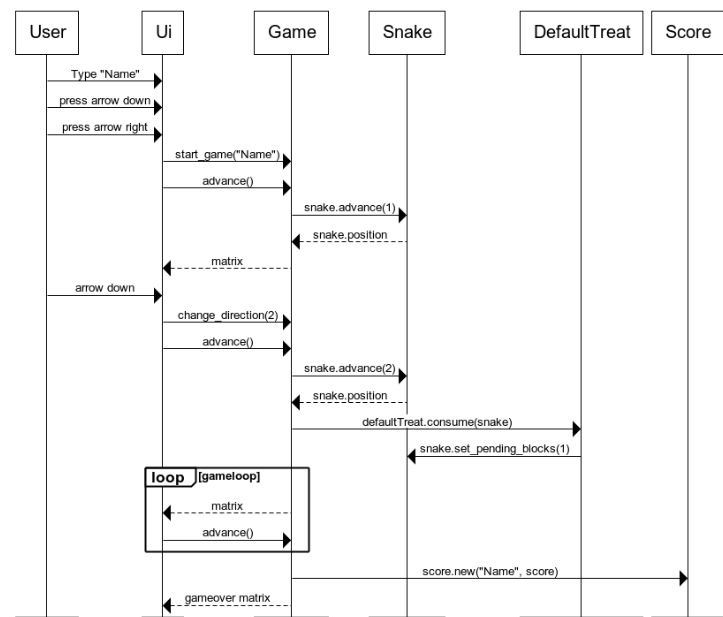

## Ohjelman rakenne

### Arkkitehtuuri

## Peli noudattaa seuraavanlaista rakennetta:

### Pelin eteneminen

Kun pelaaja syöttää alkuvalikossa nimekseen "Name" ja aloittaa pelin ja painaa kerran nuolta alaspäin, voi pelin toiminta näyttää seuraavalta:

Ui kutsuu olion Game advance metodia edistääkseen pelin tilaa yhdellä. Kun pelaaja painaa nuolinäppäintä, Ui kutsuu Game-olion change_direction metodia nuolinäppäintä vastaavalla numerolla. Gamen advance-metodi kutsuu Snake-olion advance metodia pelin senhetkisellä suunnalla, ja mato päivittää oman tilansa. Tämän jälkeen mato palauttaa sijaintinsa Game-oliolle, ja Game päivittää oman tilansa. Jos peli huomaa että mato on DefaultTreat-olion päällä, se kutsuu olion consume metodia ja antaa sille snake-olion argumentiksi. DefaultTreat kutsuu madon metodia set_pending_blocks(1), jos mato on matoa pidentävän karkin päällä. Lopulta mato osuu seinään, ja peli tallentaa pelaajan pisteet kutsumalla score-oliota argumenteilla "Name" ja sore, missä score on syötyjen karkkien lukumäärä. Tämän jälkeen Game-olio palauttaa Ui-oliolle tietyn matriisin, jonka jälkeen Ui tietää päättää pelin.
