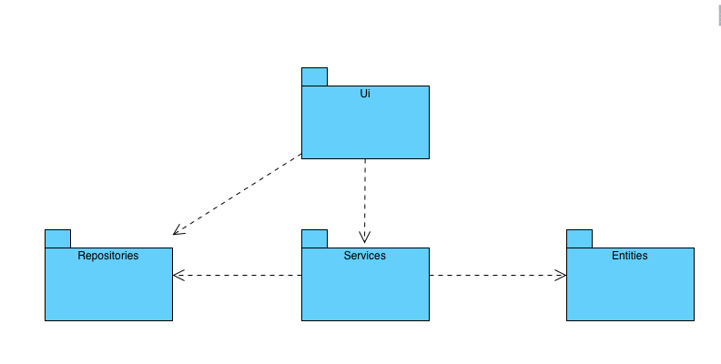
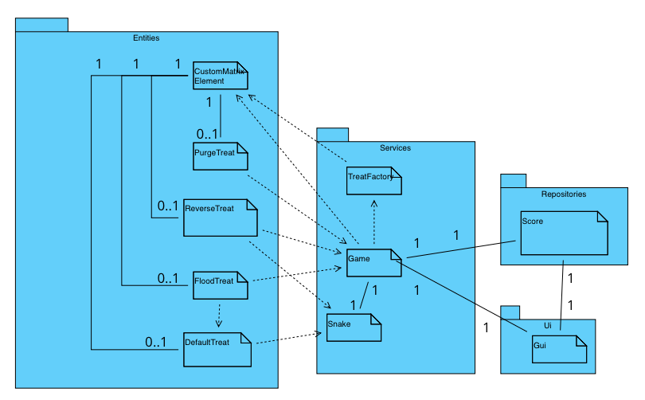

# Ohjelman rakenne

## Arkkitehtuuri

### Peli noudattaa seuraavanlaista rakennetta:



Ui sisältää käyttöliittymään liittyvän koodin. Services sisältää pelilogiikkaan liittyvän koodin. Tämä tarkoittaa käytännössä pysyviä luokka-olioita, joista luodaan vain yksi olio koko ohjelman suorituksen aikana. Entities sisältää lyhytikäisiä kulutettavia komponentteja. Lähinnä karkkeihin liittyvää koodia. Repositories sisältää pysyväistallennukseen liittyvän koodin.

## Käyttöliittymä
Pelin käyttöliittymällä on viisi näkymää:
- Päävalikko
- nimivalikko
- vaikeustasovalikko
- Peli
- High Score

Päävalikossa pelaaja syöttää nimensä pelille. Päävalikosta voi siirtyä tarkastelemaan korkeimpia pisteitä high-score näkymään, tai peli-näkymään pelaamaan peliä.

Käyttöliittymässä Peli-näkymä kutsuu jokaisella peliloopin kierroksella Game-luokan advance funktiota, joka edistää peliä yhden askeleen. Täten Käyttöliittymä on myös vastuussa pelin taajuudesta.

Nimivalikossa valitaan pelissä käytettävä nimi. Nimen valitsemisen jälkeen next-napin painaminen siirtää kontrollin vaikeustasovalikkoon.
Vaikeustason valinnan jälkeen kontrolli siirtyy pelinäkymään, missä oikeaa nuolinäppäintä painamalla peli alkaa.

## Pelilogiikka

Pelilogiikka on keskitetty Game-luokalle. Tämä tarkoittaa sitä, että Game-luokka on ainoa yhteys käyttöliittymästä pelilogiikkaan. Luokka säilyttää pelin tilan, ja päivittää muut pelilogiikan oliot kutsumalla niiden metodeja. se päivittää esimerkiksi mato-olion kutsumalla tämän advance-metodia ja pyytää TreatFactory-luokkaa luomaan uuden karkin peliin jokaisella pelin iteraatiolla.
Snake-luokka on vastuussa kaikesta matoon liittyvien tietojen tallentamisesta. Tähän sisältyy esimerkiksi madon sijainti.
TreatFactory on vastuussa pelissä ilmestyvien karkkien luomisesta ja tiettyjen karkkien ilmestymisen todennäköisyydestä.

### Luokkien suhteet
Seuraava luokka/pakkauskaavio kuvaa luokkien suhdetta



- Game->Snake:
Peli pyytää pelin jokaisella iteraatiolla Snake-oliota päivittämään itsensä kutsumalla tämän .advance-metodia argumentilla self.direction. Tämä metodi palauttaa pelille madon uuden sijainnin pelissä.

- Game->TreatFactory:
Peli pyytää pelin jokaisella iteraatiolla TreatFactory-oliota luomaan uuden karkin kutsumalla tämän .generate_random_treat metodia. Metodi palauttaa uuden karkkiolion, jonka peli lisää kartalle.

- Game->MatrixElement:
Peli tarkastaa jokaisella pelin iteraatiolla, onko madon pään kohdalla karkki. Se tekee tämän tarkistamalla kyseisessä lokaatiossa sijaitsevan MatrixElement-olion .type attribuutin. Jos tämä on "treat", "dual_treat" tai "matrix_treat", peli kutsuu olion action.consume metodia. Peli tarkastaa myös, onko kyseinen elementti madon ruumista tarkastamalla, onko olion .type attribuutti "snake". Peli päättyy, jos näin on.

- TreatFactory->MatrixElement:
TreatFactory arpoo uutta karkkia luodessaan numeron, joka päättää minkä tasoinen karkki luodaan. Tietyn numeron perusteella peli valitsee tason 1, 2 tai 3 ja suodattaa kaikkien karkkien listasta tasoa vastaavat MatrixElement-oliot joiden .tier attribuutti on kyseinen taso.

- MatrixElement ja karkkiluokat:

MatrixElement on luokka, jonka olio sisältää perustietoja kaikista pelissä esiintyvistä asioista. Pelin karkit ovat MatrixElement luokan olioita, joiden .action attribuutti on kyseisen karkkiluokan olio. Myös madon palikat sekä tyhjät ruudut ovat MatrixElement-luokan olioita, joiden .action on None, ja joiden taso on 0. Siis jokainen karkkiolio liittyy aina yhteen MatrixElement-olioon, mutta MatrixElement-olio ei välttämättä sisällä karkkioliota.

Karkkiluokat ovat riippuvaisia joko madosta, pelistä tai molemmista. Kun Karkkiolion .consume-metodia kutsutaan, tekee se muutoksia matoon tai peliin, riippuen minkä tyyppinen karkki on kyseessä. Tämä ilmoitetaan MatrixElement olion .type attribuutissa.


### Pelin eteneminen

Tarkastellaan sekvenssikaaviota tilanteesta, Missä peli etenee yhden askeleen ja peliin ilmestyy madon suunnan kääntävä karkki:

```mermaid
sequenceDiagram
  actor User
  participant GUI
  participant Game
  participant TreatFactory
  participant Snake
  
  User->>GUI:Right Arrowkey
  GUI->>Game:game.snake.change_direction(1)
  Game->>Snake:change_direction(1)
  GUI->>Game:Advance()
  Game->>Snake:Advance()
  Snake-->>Game:position(2 dimensional array)
  Game->>Game:clear_game_matrix()
  Game->>Game:update_game_matrix(position)
  Game->>TreatFactory:generate_random_treat()
  TreatFactory-->>Game:MarixElement(ReverseTreat(), "treat", 2, 20,"$")
  Game-->>GUI:game_matrix
  ```
  Tarkastellaan seuraavaksi sekvenssikaaviota tilanteesta, missä Pelaaja syö madon suunnan kääntäävn karkin (jatkoa edelliselle sekvenssikaaviolle):
 
```mermaid
sequenceDiagram
  actor User
  participant GUI
  participant Game
  participant TreatFactory
  participant Snake
  participant MatrixElement
  participant ReverseTreat
  GUI->>Game:advance()
  Game->>Snake:advance()
  Snake-->>Game:position (2 dimensional list)
  Game->>Game:is_treat(position[-1])
  Game->>MatrixElement:MatrixElement.action.consume(self, snake)
  MatrixElement->>ReverseTreat:consume()
  ReverseTreat->>Game: change_direction(-1)
  ReverseTreat->>Snake:set_position(reversed(position))
  Game->>TreatFactory:new_random_treat()
  TreatFactory-->>Game: MarixElement(PurgeTreat, "matrix_treat", 2, 20,"X")
  Game-->>GUI:game_matrix
  
  
```

Siis edellisten sekvenssikaavioiden aikana pelaaja vaihtoi kulkusuunnan oikealle painamalla oikeaa nuolinäppäintä. Mato liikkui ensin tyhjän ruudun päälle, jonka jälkeen madon pään oikealle puolelle ilmestyi suunnan vaihtava karkki. Seuraavalla askeleella mato liikkui tämän karkin päälle, jolloin karkki syötiin, ja se muutti pelin suunnan, sekä madon position.


  
  
  
  

```


