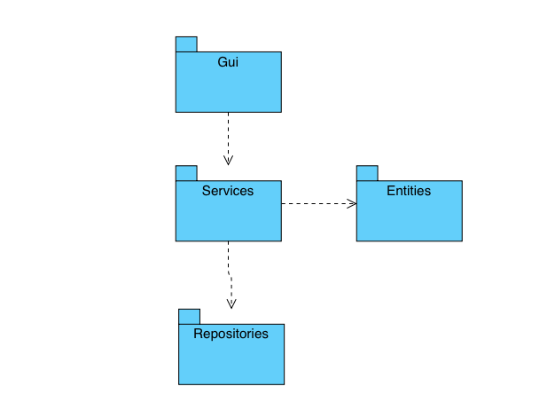

# Ohjelman rakenne

## Arkkitehtuuri

### Peli noudattaa seuraavanlaista rakennetta:

Gui sisältää käyttöliittymään liittyvän koodin. Services sisältää pelilogiikkaan liittyvän koodin. Tämä tarkoittaa käytännössä pysyviä luokka-olioita, joista luodaan vain yksi olio koko ohjelman suorituksen aikana. Entities sisältää lyhytikäisiä kulutettavia komponentteja. Lähinnä karkkeihin liittyvää koodia. Repositories sisältää pysyväistallennukseen liittyvän koodin.

## Käyttöliittymä
Pelin käyttöliittymällä on kolme näkymää:
- Päävalikko
- Peli
- High Score

Päävalikossa pelaaja syöttää nimensä pelille. Päävalikosta voi siirtyä tarkastelemaan korkeimpia pisteitä high-score näkymään, tai peli-näkymään pelaamaan peliä.

Käyttöliittymässä Peli-näkymä kutsuu jokaisella peliloopin kierroksella Game-luokan advance funktiota, joka edistää peliä yhden askeleen. Täten Käyttöliittymä on myös vastuussa pelin taajuudesta.

## Pelilogiikka

Pelilogiikka on keskitetty Game-luokalle. Tämä tarkoittaa sitä, että Game-luokka on ainoa yhteys käyttöliittymästä pelilogiikkaan. Game-luokka säilyttää pelin tilan, ja päivittää muut pelilogiikan oliot kutsumalla niiden metodeja. Game-luokka päivittää esimerkiksi mato-olion kutsumalla tämän advance-metodia. Game-luokka myös pyytää TreatFactory-luokkaa luomaan uuden karkin peliin jokaisella pelin iteraatiolla.
Snake-luokka on vastuussa kaikesta matoon liittyvien tietojen tallentamisesta. Tähän sisältyy esimerkiksi madon sijainti.
TreatFactory on vastuussa pelissä ilmestyvien karkkien luomisesta.

### Pelin eteneminen

Kun pelaaja syöttää alkuvalikossa nimekseen "Name" ja aloittaa pelin ja painaa kerran nuolta alaspäin, voi pelin toiminta näyttää seuraavalta:

Ui kutsuu olion Game advance metodia edistääkseen pelin tilaa yhdellä. Kun pelaaja painaa nuolinäppäintä, Ui kutsuu Game-olion change_direction metodia nuolinäppäintä vastaavalla numerolla. Gamen advance-metodi kutsuu Snake-olion advance metodia pelin senhetkisellä suunnalla, ja mato päivittää oman tilansa. Tämän jälkeen mato palauttaa sijaintinsa Game-oliolle, ja Game päivittää oman tilansa. Jos peli huomaa että mato on DefaultTreat-olion päällä, se kutsuu olion consume metodia ja antaa sille snake-olion argumentiksi. DefaultTreat kutsuu madon metodia set_pending_blocks(1), jos mato on matoa pidentävän karkin päällä. Lopulta mato osuu seinään, ja peli tallentaa pelaajan pisteet kutsumalla score-oliota argumenteilla "Name" ja sore, missä score on syötyjen karkkien lukumäärä. Tämän jälkeen Game-olio palauttaa Ui-oliolle tietyn matriisin, jonka jälkeen Ui tietää päättää pelin.
