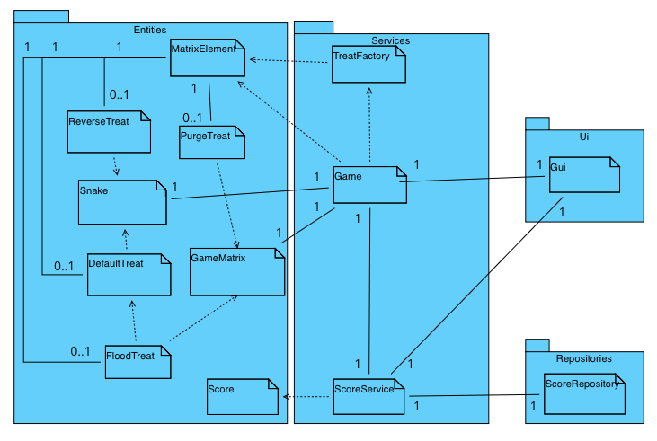

# Arkkitehtuurikuvaus


### Rakenne

Peli noudattaa kolmitasoista kerrosarkkitehtuuria seuraavanlaisella pakkausrakenteella:


Ui sisältää käyttöliittymään liittyvän koodin. Services sisältää pelilogiikkaan liittyvän koodin. Entities sisältää pelilogiikan käyttämiä tietokohteita kuvaavia luokkia sekä lyhytikäisiä komponentteja. Tämä tarkoittaa esimerkiksi Pelissä ilmestyviä karkkeja. Repositories sisältää pysyväistallennukseen liittyvän koodin.

## Käyttöliittymä
Pelin käyttöliittymällä on viisi näkymää:
- Päävalikko
- nimivalikko
- vaikeustasovalikko
- Peli
- Game over - näkymä
- High Score

Käyttöliittymä on toteutettu yhtenä View-luokkana, jonka metodeja näkymät ovat. Näkymien välillä siirrytään lopettamalla senhetkinen loop ja kutsumalla toista luokan View metodia. View-luokalle on injektoitu Game- ja ScoreService-luokkien oliot.

Käyttöliittymässä Peli-näkymä kutsuu jokaisella peliloopin kierroksella Game-luokan advance funktiota, joka edistää peliä yhden askeleen. Täten Käyttöliittymä on myös vastuussa pelin taajuudesta. Pelin vaikeustasot ovatkin säädetty muuttamalla Pelin taajuutta riippuen siitä, mikä vaikeustaso valittiin.

High Score-näkymässä korkeimmat pisteet haetaan kutsumalla ScoreService-olion .all metodia, joka palauttaa kaikki tulokset suuruusjärjestyksessä pienimmästä suurimpaan Score-oliona.

Nimivalikossa valitaan pelissä käytettävä nimi. Nimen valitsemisen jälkeen next-napin painaminen siirtää kontrollin vaikeustasovalikkoon.
Vaikeustason valinnan jälkeen kontrolli siirtyy pelinäkymään, missä oikeaa nuolinäppäintä painamalla peli alkaa.

## Pelilogiikka

### Game
Game-olio on vastuussa matopelin pelilogiikasta ja tarkistaa madon liikkeeseen kuuluvat ehdot. Se pyytää pelin jokaisella iteraatiolla TreatFactory-luokkaa luomaan uuden karkin kartalle. Game-oliolle injektoidaan Snake-olio, joka on vastuussa madon sijainnin muistamisesta sekä madon liikuttamisesta, GameMatrix-olio, joka on vastuussa pelin matriisin sekä karkkien sijaintien muistamisesta, sekä ScoreService-olio, joka on Game-olion sekä käyttöliittymän rajapinta pysyväistallennukseen.

### TreatFactory
TreatFactory on vastuussa pelissä ilmestyvien karkkien luomisesta ja tiettyjen karkkien ilmestymistodennäköisyydestä. Game-olio kutsuu jokaisella pelin iteraatiolla TreatFactoryn .new_random_treat metodia, joka valitsee satunnaisen tason karkille (1-3) ja valitsee sitten satunnaisen tasoa vastaavan karkin.

### ScoreService
ScoreService on käyttöliittymän sekä Game-olion rajapinta ScoreRepository-luokkaan, eli pysyväistallennukseen.


### Luokkien suhteet
Seuraava luokka/pakkauskaavio kuvaa luokkien suhdetta



### Treat-olioiden riippuvuus pelilogiikkaan

Kaikki pelin matriisin alkiot ovat MatrixElement-olioita. Tyhjillä ruuduilla olion .type attribuutti on "empty" ja madon ruumista vastaavilla alkioilla "snake". Karkit ovat MatrixElement-olioita, joille on injektoitu jokin Entities-hakemistossa olevista Treat-olioista .action attribuutiksi. Jokaisella Treat oliolla on .consume-metodi, joka ottaa argumentikseen joko Game- tai Snake-olion. .consume metodi kutsuu argumentiksi saadun olion muuttujia saaden aikaan erilaisia efektejä, kuten madon pidentymisen tai lyhentymisen, tai madon suunnan kääntymisen.


## Tietojen pysyväistallennus

Peli käyttää yhtä sqlite-tietokantaa, jossa on yksi taulu scores. Tällä taululla on neljä kenttää: id, pelaajan nimi, pisteet sekä vaikeustaso. Game-olio tallentaa tauluun uuden tuloksen pelin päättyessä kutsumalla Score-olion .new-metodia.

### Pelin eteneminen

Tarkastellaan sekvenssikaaviota tilanteesta, Missä peli etenee yhden askeleen ja peliin ilmestyy madon suunnan kääntävä karkki:

```mermaid
sequenceDiagram
  actor User
  participant GUI
  participant Game
  participant TreatFactory
  participant Snake
  
  User->>GUI:Right Arrowkey
  GUI->>Game:game.snake.change_direction(1)
  Game->>Snake:change_direction(1)
  GUI->>Game:Advance()
  Game->>Snake:Advance()
  Snake-->>Game:position(2 dimensional array)
  Game->>Game:remove_previous_snake()
  Game->>Game:draw_snake(position)
  Game->>TreatFactory:new_random_treat()
  TreatFactory-->>Game:MarixElement(ReverseTreat(), "treat", 2, 20,"<-")
  Game-->>GUI:game_matrix
  ```
  Tarkastellaan seuraavaksi sekvenssikaaviota tilanteesta, missä Pelaaja syö madon suunnan kääntävän karkin (jatkoa edelliselle sekvenssikaaviolle):
 
```mermaid
sequenceDiagram
  actor User
  participant GUI
  participant Game
  participant TreatFactory
  participant Snake
  participant MatrixElement
  participant ReverseTreat
  GUI->>Game:advance()
  Game->>Snake:advance()
  Snake-->>Game:position (2 dimensional list)
  Game->>Game:is_treat(position[-1])
  Game->>MatrixElement:MatrixElement.action.consume(snake)
  MatrixElement->>ReverseTreat:consume(snake)
  ReverseTreat->>Snake:set_position(reversed(position))
  ReverseTreat->>Snake: change_direction(3)
  Game->>TreatFactory:new_random_treat()
  TreatFactory-->>Game: MarixElement(PurgeTreat(), "matrix_treat", 2, 20,"X")
  Game-->>GUI:game_matrix 
```

Siis edellisten sekvenssikaavioiden aikana pelaaja vaihtoi madon kulkusuunnan oikealle painamalla oikeaa nuolinäppäintä. Mato liikkui ensin tyhjän ruudun päälle, jonka jälkeen madon pään oikealle puolelle ilmestyi suunnan vaihtava karkki. Seuraavalla askeleella mato liikkui tämän karkin päälle, jolloin karkki syötiin, ja se muutti madon suunnan, sekä sen position. Tämän jälkeen Peli pyysi TreatFactorya luomaan uuden karkin, joka sattui tällä kertaa olemaan PurgeTreat, joka poistaa kaikki karkit kartalta.
