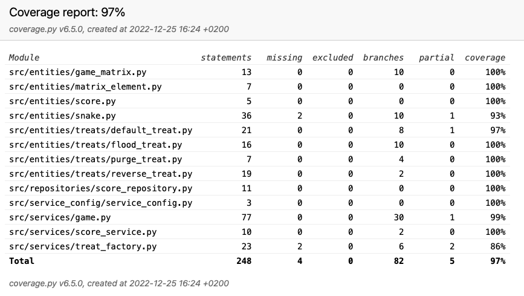

# Testausdokumentti

Ohjelmaa testataan unittestillä automaattisilla yksikkö- sekä integraatiotesteillä. Ohjelmaa on testattu myös manuaalisilla järjestelmätesteillä.

## yksikkötestaus

### Sovelluslogiikka
**Game**-oliota testataan TestGame - testiluokalla. TestGamen testeissä Testattavalle Game-luokalle injektoidaan Tietokantaoliona ja Snake-oliona MagicMock-oliot,
Joilla on ennalta määrätyt paluuarvot.

**Snake**-oliota testataan TestSnake - testiluokalla. Snake-luokkaa testataan injektoimalla sille lähtötilanne, ja varmistamalla että mato liikkuu oikein,
Eli että sen self.position attribuutti on .advance-metodin kutsujen jälkeen haluttu arvo.

**TreatFactory**-oliolla ei toistaiseksi ole omaa testiluokkaa.

### Entities-luokkien testaus

Treat-olioita testataan kutsumalla niiden .consume-metodia MagicMock-argumentein. Testeissä varmistetaan, että karkit syötynä kutsuvat muutettavan olion oikeaa
metodia oikealla arvolla.

### Repositories-luokkien testaus
Pelin repositories-kansiossa olevia luokka-olioita, eli tietokantatauluja vastaavia luokkia testataan injektoimalla niille MagicMock-olio db-parametrinä, eli
tietokantana. Testeissä varmistetaan, että tietyillä parametreillä luokat kutsuvat tietokantaa oikealla SQL-kyselyllä.

## Integraatiotestaus

Ohjelman Integraatiotestaus tapahtuu yhdessä testiluokassa TestIntegration. Tässä luokassa testattaville luokille injektoidaan todelliset sovelluslogiikan
luokkaoliot, eikä Mock-olioita. Testiluokan jokaisessa testimetodissa luodaan Game-olio, jolle injektoidaan Snake-olio, sekä testitietokantaolio.
Toisin kuin repositories-luokan testeissä, integraatiotestissä luodaan oikea tietokanta, jonne testien tulokset tallennetaan.

TestIntegration-luokan testeissä pelissä matoa liikutellaan useiden karkkien päälle, ja tarkistetaan, että jokaisen luokan tiedot päivittyvät oikein.
Tähän kuuluu Snake-olion position, Pending_blocks ja direction, sekä Game-olion points.

## Testikattavuus
25.12.2022 Testikattavuus on 97%

## Järjestelmätestaus

Pelin järjestelmätestaus suoritetaa manuaalisesti pelaamalla peliä ja kokeilemalla sen erilaisia toimintoja ja näiden yhdistelmiä.

## Sovelluksen laatuongelmat

Sovellus kaatuu pelin päättyessä, mikäli tietokantaa ei ole alustettu komennolla poetry run invoke build.

